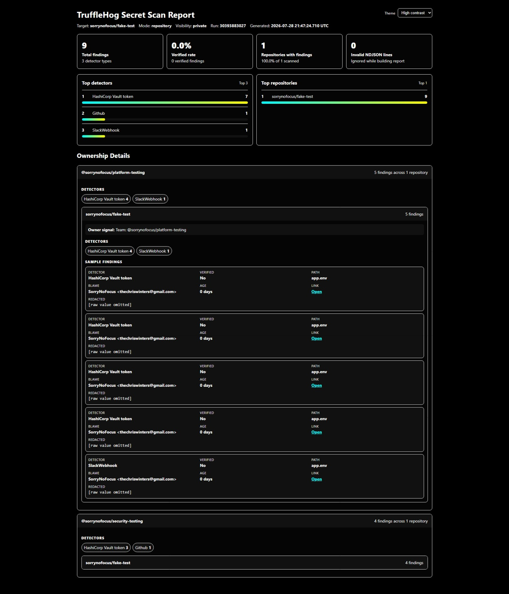
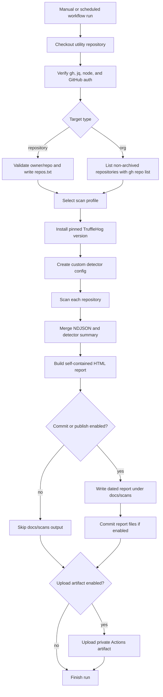

# Utility Repo

This is a collection of my utilities, notes, and workflows.

Here's a list of utilties included in this repository:

- TruffleHog Secret Scan Workflow (this is located in `.github/workflows/trufflehog.yml`)

Below are _README_ files for the included utilities.

---
---

## TruffleHog Secret Scan Workflow

This repository includes a GitHub Actions workflow for running TruffleHog against either one repository or every repository owned by a GitHub org/user. By default, the workflow is private-test friendly: it uploads the report as a workflow artifact and does not commit or publish reports unless explicitly enabled.



### Required Secret

Add this repository secret before running scans:

```text
TRUFFLEHOG_SCAN_TOKEN
```

The token must have `read` access to the repositories being scanned. For private org/user-wide scans, use a token with `repository read access` and `organization read access` where applicable.

### Configuration

The workflow is designed to run with minimal committed configuration. Most runtime files are generated during the GitHub Actions run.

| Configuration | Path or Setting | Purpose |
| --- | --- | --- |
| GitHub scan token | Repository secret `TRUFFLEHOG_SCAN_TOKEN` | Token used by `gh` and TruffleHog to read target repositories. The workflow can fall back to `GH_DISPATCH_PAT` or `github.token`, but `TRUFFLEHOG_SCAN_TOKEN` is preferred. |
| Owner/manager fallback map | `.github/workflows/conf/team-repo-em.json` | Optional JSON map used when CODEOWNERS is missing, unavailable, or has no matching team rule. Match entries by `repo: "owner/repo"`. |
| CODEOWNERS | Target repo `CODEOWNERS`, `.github/CODEOWNERS`, or `docs/CODEOWNERS` | Preferred ownership source. If a matching rule contains an `@owner/team`, the report groups findings under that team. |
| Custom detector config | Generated runtime file `config.yaml` | Created during the workflow run. Currently adds the HashiCorp Vault token custom detector. Do not commit this generated file. |
| Repository list | Generated runtime file `repos.txt` | Created during the workflow run from the selected scan mode and target. Do not commit this generated file. |
| Raw scan output | Generated runtime files under `reports/` | Contains merged NDJSON, detector summary, per-repository NDJSON, and `reports/index.html`. Do not commit unless intentionally publishing reports. |
| Pages output | `docs/scans/trufflehog/` and `docs/scans/trufflehog.md` | Created only when report publishing is enabled. Keep disabled while testing private scans. |

Fallback manager map format:

```json
[
  {
    "repo": "sorrynofocus/Jotter",
    "team": "Jotter",
    "EM": "Chris Winters"
  }
]
```

Supported manager field names are `EM`, `manager`, or `engineeringManager`. Supported team field names are `team` or `owner`.

Optional environment overrides for local testing or advanced workflow changes:

| Environment variable | Default | Purpose |
| --- | --- | --- |
| `REPORT_MANAGER_MAP_PATH` | `.github/workflows/conf/team-repo-em.json` | Override the fallback manager map path. |
| `TRUFFLEHOG_NDJSON_PATH` | `reports/_merged.ndjson` | Read report input from a different NDJSON file. |
| `REPORT_HTML_PATH` | `reports/index.html` | Write the generated HTML report to a different path. |
| `REPORT_OUTPUT_DIR` | `reports` | Change the report output directory. |
| `REPORT_PAGES_DIR` | `docs/scans/trufflehog` | Change where dated Pages HTML reports are written. |
| `REPORT_INDEX_MARKDOWN_PATH` | `docs/scans/trufflehog.md` | Change where the Pages report index Markdown is written. |
| `REPOSITORY_LIST_PATH` | `repos.txt` | Change where the scanned repository list is read from. |
| `REPORT_THEME_DEFAULT` | `light` | Set the initial report theme. Users can still switch themes in the report UI. |
| `REPORT_DEBUG` | `0` | Enable debug logging with `1`, `true`, `yes`, or `on`. |
| `REPORT_PUBLISH_PAGES` | `false` | Controls whether Pages output files are generated. The workflow sets this from publish-related inputs. |

Recommended `.gitignore` entries:

```gitignore
reports/
config.yaml
repos.txt
docs/scans/trufflehog/*.html
.github/workflows/scripts/trufflehog/fixtures/
FAKE-TEST/
```


### Workflow Inputs

| Parameter | Default | Description |
| --- | --- | --- |
| Scan mode (`scan_target_type`) | `repository` | Choose whether to scan one repository or every non-archived repository under an owner/org. |
| Scan target (`scan_target`) | `sorrynofocus/utility` | For repository mode, enter `owner/repo`. For org mode, enter only the owner/org name. |
| Repository visibility (`repository_visibility`) | `private` | Only used for org scans. Choose `private`, `public`, or `all`. |
| Scan profile (`scan_profile`) | `strict` | Controls whether TruffleHog reports only verified findings or includes likely/noisy findings. |
| Repository scan limit (`repository_scan_limit`) | `50000` | Only used for org scans. Limits how many repositories are listed and scanned. |
| Report rows per repository (`report_max_rows_per_repository`) | `300` | Limits how many sample finding rows appear for each repository in the HTML report. |
| Upload report artifact (`upload_artifact`) | `true` | Uploads `reports/index.html`, raw NDJSON, summaries, and scan metadata as a private Actions artifact. |
| Commit report files (`commit_report_to_repo`) | `false` | Commits dated report files to `docs/scans`. Keep off while testing. |
| Generate Pages report files (`publish_pages_report`) | `false` | Writes GitHub Pages-ready report files. Keep off unless Pages exposure is intended. |
| Artifact retention (`artifact_retention_days`) | `7` | Controls how many days GitHub keeps uploaded workflow artifacts. |

### Scan Profiles

| Profile | Use For | Result Flags |
| --- | --- | --- |
| `strict` | Real scans where only verified secrets should be reported. | `--results=verified --filter-entropy=4.5` |
| `real` | Real scans where likely/unknown findings are useful. | `--results=verified,unknown --filter-entropy=4.0` |
| `verbose` | Testing with fake secrets or reviewing noisy scanner behavior. | `--results=verified,unknown,unverified --filter-entropy=3.0` |

All profiles also use:

```text
--allow-verification-overlap --concurrency=8 --force-skip-binaries
```

### Recommended First Runs

Single repository test:

| Parameter | Value |
| --- | --- |
| Scan mode (`scan_target_type`) | `repository` |
| Scan target (`scan_target`) | `sorrynofocus/utility` |
| Repository visibility (`repository_visibility`) | `private` |
| Scan profile (`scan_profile`) | `strict` |
| Upload report artifact (`upload_artifact`) | `true` |
| Commit report files (`commit_report_to_repo`) | `false` |
| Generate Pages report files (`publish_pages_report`) | `false` |

Fake-secret test repository:

| Parameter | Value |
| --- | --- |
| Scan mode (`scan_target_type`) | `repository` |
| Scan target (`scan_target`) | `sorrynofocus/fake-test` |
| Scan profile (`scan_profile`) | `verbose` |
| Upload report artifact (`upload_artifact`) | `true` |
| Commit report files (`commit_report_to_repo`) | `false` |
| Generate Pages report files (`publish_pages_report`) | `false` |

Owner/org scan:

| Parameter | Value |
| --- | --- |
| Scan mode (`scan_target_type`) | `org` |
| Scan target (`scan_target`) | `sorrynofocus` |
| Repository visibility (`repository_visibility`) | `all` |
| Repository scan limit (`repository_scan_limit`) | `50` |
| Scan profile (`scan_profile`) | `strict` |
| Upload report artifact (`upload_artifact`) | `true` |
| Commit report files (`commit_report_to_repo`) | `false` |
| Generate Pages report files (`publish_pages_report`) | `false` |

### Report UI

The final HTML report can be viewed by _downloading the workflow artifact and opening `reports/index.html`_ or automatically published to Github Pages.

_Note_: Typical Github pages cannot be _private_ unless you upgrade Github or enter an enterprise plan.


1. Download and View Report

    Download the workflow artifact and open:

    ```text
    reports/index.html
    ```

    The report includes:

    - summary metrics
    - selected scan profile and flags
    - top detectors
    - top repositories
    - ownership grouping from `CODEOWNERS`
    - fallback owner/manager mapping from `.github/workflows/conf/team-repo-em.json`
    - light, dark, and high-contrast themes

    The theme selector is in the top-right of the report.

2. Pages Publishing

    _Note:_ Keep Pages **off** while testing!

    To publish reports later:

    1. Enable GitHub Pages from `Settings` -> `Pages`.
    2. Use `Deploy from a branch`.
    3. Select the default branch and `/docs`.
    4. Run the workflow with:

    ```text
    commit_report_to_repo: true
    publish_pages_report: true
    ```

    Only enable this when report visibility is acceptable for the repository and account settings.

### Workflow


---
---


